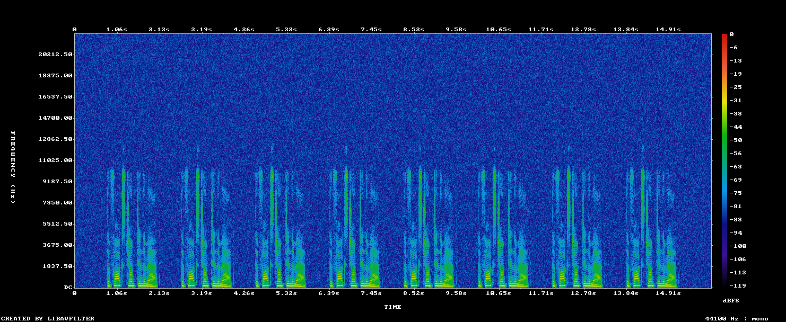
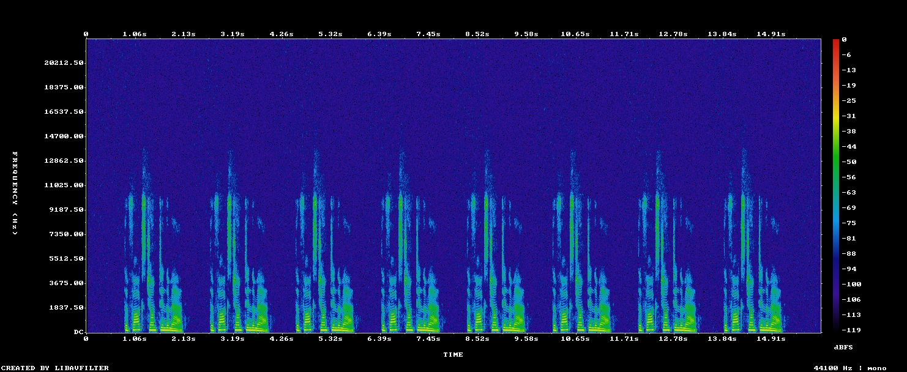

# Kosmos

[Download for Mac](https://github.com/Parafield-Official/kosmos/releases/download/v0.1.3/Kosmos-0.1.3-mac-arm64.dmg) · [Download for Windows](https://github.com/Parafield-Official/kosmos/releases/download/v0.1.3/Kosmos-0.1.3-win-x64.exe)

Kosmos is a free desktop studio for human-made audiobooks. Import a manuscript,
record each chapter or bring audio from another editor, proofread the take
against the page, master the sound, and export a delivery-ready book.

The project stays in a folder on your computer. Kosmos has no account,
subscription, usage meter, analytics, cloud manuscript upload, AI narrator, or
voice cloning. Automation helps with words and delivery specs; a human still
makes the final listening and performance decisions.

## Lightbox workflow

Every chapter moves through the same three stages:

1. **Record** — read from a voice-following teleprompter, check the room, record
   chapter takes, and punch individual lines. You can also import an existing
   recording.
2. **Proofread** — compare the take with the manuscript, play each flagged line,
   leave notes, and turn real mismatches into pickups.
3. **Sound** — listen to the original, working, and mastered takes; master for
   ACX or EBU; and inspect loudness, true peak, noise floor, format, and room
   tone before delivery.

The wider book workspace adds TXT, Markdown, DOCX, EPUB, and text-layer PDF
import; chapter split, merge, and rename; pronunciation guides with human voice
clips; author and narrator roles; duet seats; live invites; progress tracking;
and a named ACX export pack with credits and a retail sample.

Kosmos includes an audiobook-focused recorder, but it is not a general-purpose
multitrack music workstation. Narrators can record and punch directly in Kosmos
or continue using Reaper, Audition, or another editor and import the result.

This is a pre-release development build. Release packaging includes the audited
FFmpeg/ffprobe and whisper.cpp runtimes plus checksum-verified local speech
models. Rich manuscript imports use Microsoft's offline
[MarkItDown](https://github.com/microsoft/markitdown) helper with a built-in
fallback.

## Install

1. Choose the Mac or Windows download from the latest GitHub Release.
2. On macOS, open the download and drag Kosmos to Applications. If Gatekeeper
   blocks an unsigned pre-release, right-click the app and choose **Open**.
3. On Windows, run the installer. If SmartScreen appears, choose **More info →
   Run anyway**.
4. On first launch, allow microphone access, choose where project folders live,
   and confirm the local proofreading tool is ready. Release builds include the
   required tools; if a model is missing, setup downloads it once.

Download the current release once. After setup, recording, proofreading,
mastering, and export run locally. Later versions arrive through the in-app
updater; restart when you are not recording. Your book folder is unchanged.

## Start a book

1. Create a project and choose a manuscript.
2. Choose the local folder where Kosmos will keep the project.
3. Let Kosmos analyze and split the manuscript into chapters.
4. Open a chapter and **Record**, or import an existing recording.
5. Continue to **Proofread**, resolve the flags, then open **Sound** to master
   and check the chapter.
6. When every chapter is mastered, export the finished book from **Export ACX**.

## ACX mastering and automatic noise cleanup

Export is one click for work Kosmos can perform safely. It checks the selected
delivery target, reconstructs detected clicks and clipped peaks, applies
conservative steady-noise reduction when needed, normalizes level, limits
peaks, resamples and mixes channels, adds compliant room tone, encodes the
delivery file, then measures the encoded file again. The app shows one
checklist of what was changed and what the delivered file actually passed.

The graphs below come from the deterministic noisy-narration fixture used by
`verify:delivery`. Time runs left to right, frequency runs bottom to top, and
brighter colors mean more audio energy. In the first graph, the blue haze
across the full height is broadband room noise:



After automatic cleanup, that haze is darker while the bright speech shapes
remain in the same places:



FFmpeg independently measures the quiet window moving from −58.8 to
−68.8 dBFS while the narration remains −31.4 dBFS before and after. That gives
the delivered file more room under ACX's −60 dBFS noise-floor limit without
turning down or sanding away the voice. Cleanup is capped at 12 dB; if a take
needs more than that, Kosmos refuses to ship it instead of applying destructive
processing.

Kosmos uses the same scan → diagnose → repair candidate → preservation check →
commit-or-pickup pattern across automatic restoration. Click and clipping repair
now runs before noise reduction and mastering; plosive, dereverb, changing-room,
and best-take selection workflows are specified in
[`docs/AUTOMATIC_AUDIO_REPAIR.md`](docs/AUTOMATIC_AUDIO_REPAIR.md). A person
still confirms the listening experience, but the app prepares the exact pickup
only when a bounded repair cannot preserve the human voice.

## Offline by design

Manuscript prep, recording, voice follow, proofreading, ACX checking, mastering,
and export are local. The app has no sign-in, telemetry, crash phone-home,
cloud LLM, voice clone, or remote narrator marketplace. Collaboration is
explicit: invite another person to the project or hand off the project folder.

## Build from source (contributors)

Requirements: Node.js 20+ and npm. Release packaging also needs the platform
toolchain used by Electron Builder.

```sh
npm install
npm test
npm run typecheck
npm run dev
```

### Verifying against other tools

`npm test` checks our code against our own expectations, which cannot catch a
mistake we made twice. `npm run verify` checks the parts that make a claim about
the outside world against tools that were not written here, on real audio:

| Command | What it proves, and who says so |
|---|---|
| `verify:acx` | The mastered MP3 meets ACX's numbers, measured by ffmpeg's `astats` and `volumedetect` rather than by us — and an unfixable take is refused instead of shipped. |
| `verify:delivery` | FFmpeg's adaptive cleanup lowers steady noise without changing narration level, the cleanup cap is enforced, and an EBU R128 delivery is really 48 kHz mono 24-bit PCM WAV. |
| `verify:restoration` | FFmpeg reconstructs planted clicks and clipped peaks, while a clean narration control stays sample- and level-neutral. |
| `verify:loudness` | Our LUFS meter agrees with ffmpeg's `ebur128` on sines, noise and gated speech at both sample rates. |
| `verify:markers` | Every marker export parses as the editor that imports it expects, read back with Python's `csv` module. |
| `verify:packet` | The pickup packet's clips are playable MP3s (`ffprobe`), its spreadsheet opens in `openpyxl`, and its page is well-formed HTML. |
| `verify:collab` | A pack written by the app's own ZIP writer opens in Python's `zipfile` and imports back with the right merge, checked against the bytes on disk. |
| `verify:proof` | The proof pass scores precision and recall against takes spoken by the macOS voices and decoded by the bundled whisper build. |
| `verify:book` | The occurrence scan, the whole-book pickup list and the word filter hold up on those real recordings, and the bundled dictionary's respellings are the ones a narrator wants. |

`verify:proof` and `verify:book` need the speech model (`npm run prepare:model`)
and macOS `say`; the rest run anywhere the vendored ffmpeg does. `verify:packet`
also needs Python with `openpyxl`.

### Looking at the panels

Reviewing an interface by reading JSX is guesswork. The design workbench renders
the working panels with realistic content — a book mid-proof, a name read two
ways, a pack that disagrees with yours — so a layout can be looked at:

```bash
npm run design                       # serves design/preview.html
npm run design:shots                 # writes design/shots/*.png
npm run design:shots -- --width 760  # the narrow column, for wrapping
```

Open `http://127.0.0.1:5173/design/preview.html` for every panel, add
`?panel=pickups` for one, and `&open` to photograph menus open. The page is dev
only and is not part of the production entry, so nothing there ships.

For contributors testing a locally built whisper.cpp engine, point the desktop
shell at it without changing the project format:

```sh
WHISPER_CLI_PATH=/path/to/whisper-cli \
WHISPER_SERVER_PATH=/path/to/whisper-server \
WHISPER_MODEL_PATH=/path/to/ggml-small.en.bin \
npm run dev
```

For a production bundle:

```sh
npm run build
npm run package:mac   # on macOS
npm run package:win   # on Windows
```

The packaging commands fetch and verify the pinned official Whisper model as a
build asset before creating the installer. Release CI also bundles MarkItDown
and its DOCX/PDF conversion dependencies; end users do not run either setup
step.

## License

Kosmos is released under the [MIT License](LICENSE).
